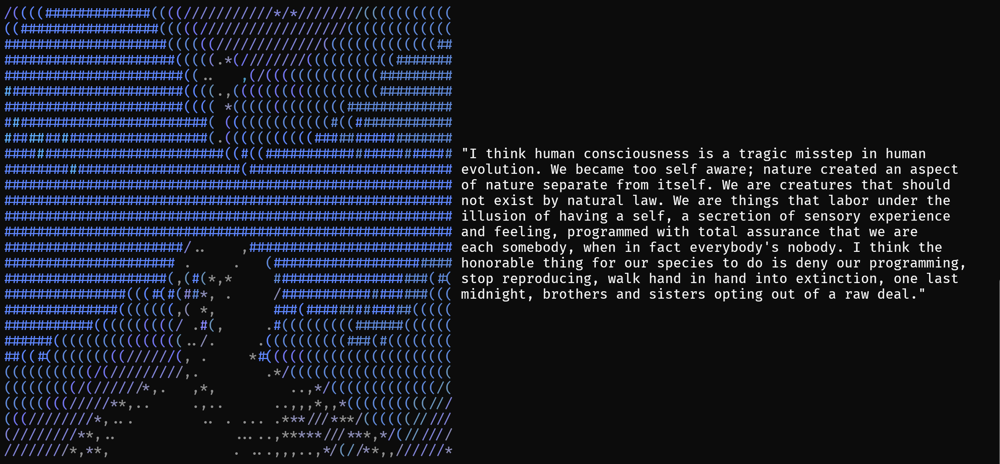

## COHLE
Rust CLI that prints Rust Cohle quotes.



**Install:**
```console
git clone https://github.com/ShettySach/cohle

cd cohle

cargo install --path .
```

**Usage:**<br> 
cohle [options] [quote_index] [image_index] [command]

**Commands:**
* list - Lists all the quotes along with their indices [aliases: l]
* display - Displays all the images along with their indices [aliases: d]
* quote - Print only quote without image [aliases: q]
* image - Print only image without quote [aliases: i]
* help - Print this message or the help of the given subcommand(s)

**Arguments:**
* [quote_index]  Index of the quote (Optional)
* [image_index]  Index of the image (Optional)

**Options:**
* -c, --col colour <br>Print quote in colour
* -b, --bg <br>Print image with black background
* -h, --help <br>Print help
* -V, --version <br>Print version

**Colours:**
* r | red
* b | blue
* y | yellow
* g | green
* m | magenta
* c | cyan
* dr | dark_red
* db | dark_blue
* dy | dark_yellow
* dg | dark_green
* dm | dark_magenta
* dc | dark_cyan
* bk | black